# Живые механики клеток в сюжетных уровнях

Сохраняем основную последовательность уровней и сайд-ивенты. Новые системы размещаются внутри привычного поля: в покрытиях, водных клетках, цветах и редких объектах. Игрок выбирает порядок открытий, запускает взаимодействия и решает, на какую находку потратить запас.

Опоры в текущем проекте: лианы и доски с несколькими слоями, реакции на соседнее открытие, вода и лодки, ракушки, лунные цветы, животные и числовые подсказки. Ниже — предлагаемые расширения этих правил. Числа служат настройками прототипа.

Иллюстрации — концепты, сгенерированные на основе арта проекта. Они показывают действия и реакции клеток; это не скриншоты реализованных уровней и не рассчитанные раскладки числовой головоломки.

## 1 Предмет внутри лианы и выбор сундука

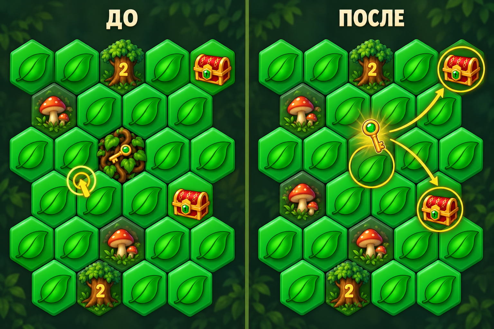

На картинке: соседнее открытие снимает последнюю лиану. Ключ освобождается, обычный лист на клетке остаётся. Игрок выбирает один из двух замков.

**Что добавляем.** У покрытия появляется необязательный вложенный предмет: ключ, деталь или награда события. Он виден поверх листа. Предмет выпадает именно при снятии последнего слоя покрытия; содержимое самой клетки раскрывается отдельно по обычным правилам.

| На поле | Действие | Результат |
| --- | --- | --- |
| Ключ в обычной лиане | Открыть подходящего соседа | Снять лиану и получить ключ |
| Ключ в двух слоях лиан | Сделать два подходящих соседних открытия либо использовать помощь | Ключ получить только после последнего слоя |
| Видимый сундук с цветным замком | Нажать сундук и потратить ключ этого цвета | Сразу получить показанную награду, без дополнительного удара |

**Решение игрока.** Потратить энергию на боковые клетки ради ключа или завершить основную цель. Если ключ уже есть — открыть сундук с энергией, сундук с древесиной либо сохранить ключ для следующих уровней и входа в событие. Ключ и замок генерируются независимо в разрешённых местах уровня.

Ключи сохраняются между уровнями. Сам пропущенный сундук остаётся на пройденном поле; вернуться к нему через выбор локации нельзя. Перед переходом дальше доступен уже найденный сундук. При нехватке ключа он предлагает докупить ровно один нужного цвета. Дополнительные цвета вводятся вместе с подходящими типами уровней.

## 2 Вода приводит в действие объект на поле

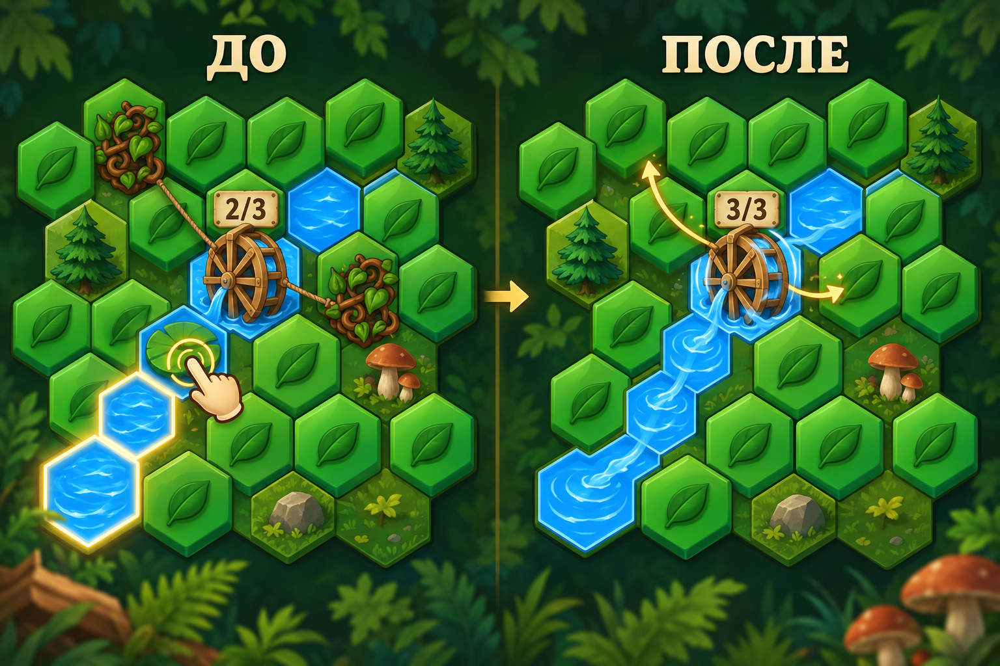

На картинке: у колеса 2 из 3 активаций. Открытие отмеченной водной клетки завершает заряд; две связанные верёвками клетки освобождаются от лиан.

**Что добавляем.** Водяное колесо связано с небольшим водоёмом и двумя конкретными клетками. Связи видны заранее. Засчитываются первые открытия водных клеток этого водоёма, в том числе бустером. Нажатие на уже открытую воду ничего не даёт.

| Состояние | Переход | Эффект |
| --- | --- | --- |
| Колесо 0/3, 1/3 или 2/3 | Открылась ещё одна отмеченная водная клетка | Счётчик увеличивается на один |
| Колесо 3/3 | Автоматическое срабатывание | Снять один слой лиан или досок с каждой из двух связанных клеток |
| Колесо отработало | Последующие открытия воды | Повторного эффекта нет |

Обычный лист под снятым покрытием остаётся закрытым. Если в последнем слое был ключ из первого раздела, он сразу освобождается. Если объект связан с дверью события, его выходом может быть активация печати вместо снятия покрытий — это видно по соединению.

**Решение игрока.** Открывать клетки у самой лианы или потратить открытия на воду, которая одновременно двигает цель уровня, лодку и колесо. Геометрия водоёма задаёт цену помощи. Работает только внутри текущего поля; состояние воды между локациями не переносится.

## 3 Бабочка направляет действие цветка

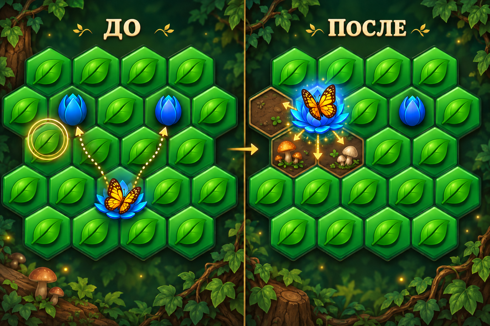

На картинке: открыта клетка около левого бутона. Бабочка летит к нему; цветок открывает ещё две клетки рядом. Правый бутон ждёт следующего действия.

**Что добавляем.** Особый нектарный бутон использует знакомую реакцию на соседнее открытие. На поле есть одна бабочка и два-три таких бутона. Обычные лунные цветы сохраняют свои правила; нектарный вариант обозначается бабочкой на лепестке.

1. Соседнее открытие будит бутон. Его две клетки помощи подсвечиваются заранее.
2. Свободная бабочка перелетает к разбуженному бутону.
3. Опылённый цветок открывает до двух отмеченных обычных клеток рядом. Лианы и доски останавливают этот эффект.
4. Бутон считается использованным. У бабочки остаётся ещё один перелёт, после которого она улетает с поля.

Если одно действие разбудило несколько бутонов, бабочка выбирает ближайший; при равенстве — первый по видимому порядку меток. Уже открытая клетка повторной награды не даёт. Действие другого объекта тоже может разбудить бутон.

**Решение игрока.** Сначала направить бабочку к цветку у нужного гриба, у водоёма или у запертого предмета. Открыть водную клетку цветком — значит одновременно приблизить запуск колеса. Два перелёта ограничивают цепочку; порядок открытий определяет её маршрут.

В цветочных сюжетных уровнях этот набор встречается чаще; в соответствующем сайд-ивенте опылённые бутоны могут быть целью уровня. Для этого не требуется дополнительная система поручений.

## 4 Собранные детали ремонтируют клеточный объект

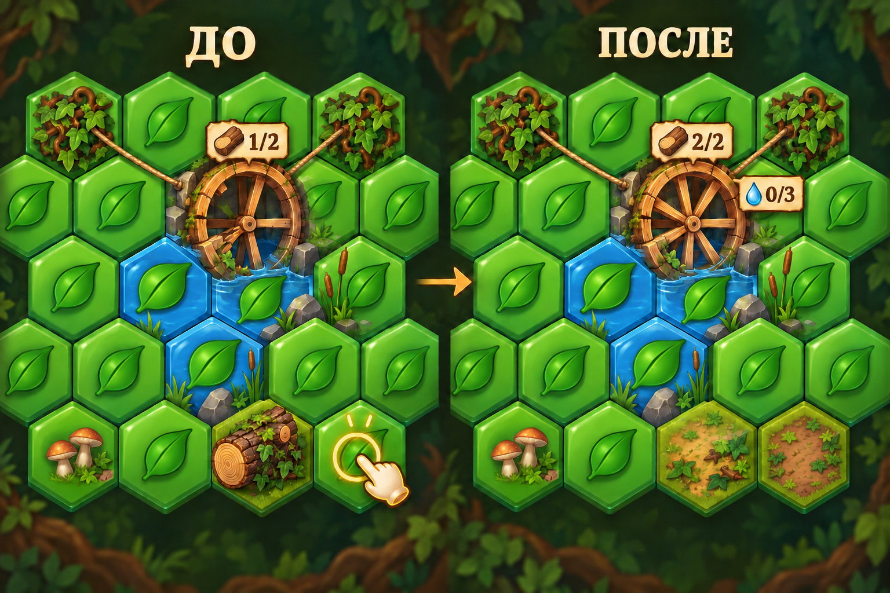

На картинке: у сломанного колеса уже есть одна из двух деталей. Из лианы освобождается древесина; после ремонта появляется обычный счётчик воды 0/3. Лианы на удалённых клетках пока остаются.

Это второй проход разработки. **Ресурс всего один — строительная древесина.** Небольшая связка крепится к покрытию так же, как ключ. Снятие последнего слоя выдаёт одну единицу в постоянный запас. Она визуально отличается от полена, которое может быть обычной целью уровня.

| Объект | Цена | Что меняется сразу на поле |
| --- | --- | --- |
| Сломанное колесо | 2 древесины | Начинает реагировать на открытия воды по правилам раздела 2 |
| Повреждённая опора сундука | 1 древесина | Сундук становится доступен для обычного открытия ключом |

Игрок нажимает на каркас и выбирает ремонт; материалы списываются только по этому действию. Находка древесины сама ничего не тратит. У колеса можно заранее открыть воду: при ремонте учитываются уже открытые отмеченные клетки. Если открыты все три, отремонтированное колесо сработает сразу.

**Решение игрока.** Потратить две детали ради помощи на текущем поле, одну ради сундука или сохранить их для следующих уровней. Ремонт меняет возможности конкретной клетки. Все каркасы размещены на предусмотренных местах в сюжетном уровне или сайд-ивенте.

Между уровнями переносится только неиспользованная древесина. Починенное колесо остаётся частью пройденного уровня. Развитие на длинной дистанции можно добавить через улучшение инструмента: например, после пяти ремонтов колёса снимают по два слоя. Это улучшение следует вводить после проверки базовых взаимодействий. Монетизация — докупка недостающей детали непосредственно у каркаса.

## 5 Дверь в сайд-ивент готовится действиями на клетках

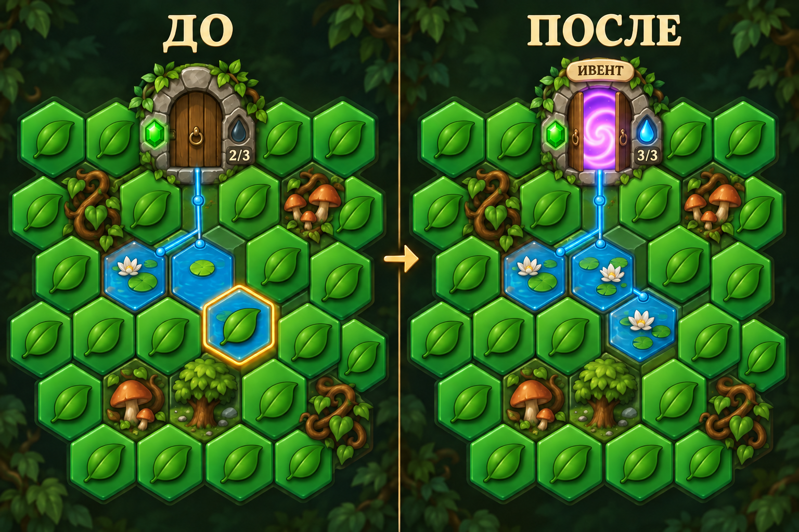

На картинке: зелёный ключ есть в запасе, водная печать заполнена на 2/3. Последняя отмеченная водная клетка делает дверь готовой к открытию.

**Что добавляем.** Редкая дверь занимает видимую клетку обычного сюжетного уровня. У неё два гнезда с понятными значками. Один показывает нужный ключ, второй — локальное условие поля.

| Вариант двери | Второе условие | Какие клетки игрок использует |
| --- | --- | --- |
| У ручья | Открыть три отмеченные клетки воды или запустить связанное колесо | Вода, бустеры, цветок рядом с водой |
| На поляне | Опылить два отмеченных бутона | Бабочка и соседние открытия |
| В зарослях | Освободить две клетки с печатями | Лианы, доски, связанное колесо |

Условие выбирается из набора, совместимого с готовой маской уровня, и фиксируется до первого хода. Его нельзя заменить задним числом. Зелёное свечение ключевого гнезда означает наличие ключа в запасе; списание происходит только при активации готовой двери.

**Решение игрока.** Выполнить основную цель кратчайшим способом или потратить дополнительную энергию на подготовку входа. Уже подготовленную дверь можно открыть тем же ключом, который подходит сундуку рядом. Награда события и его длительность показаны у двери до траты.

Активированный вход добавляет обычную кнопку сайд-ивента; основная сюжетная цепочка продолжается в прежнем порядке. До ухода с уровня можно докупить ключ, энергию либо недостающую активацию печати. Если игрок уходит с неподготовленным входом, возможность пропадает, неистраченный ключ остаётся. Таймер самого события начинается по правилам этого события после активации входа.

## 6 Общие правила создают разные комбинации

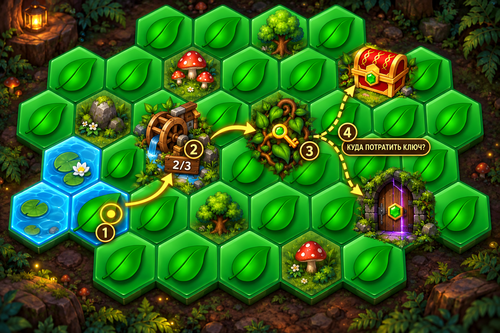

На картинке: 1 — открыть воду; 2 — колесо снимает покрытие; 3 — освобождается ключ; 4 — потратить его на сундук или вход. Ключ можно также достать напрямую через соседние открытия, а воду открыть с помощью цветка.

**Система состоит из нескольких повторно используемых правил.** Покрытие хранит предмет. Объект реагирует на заданные открытия. Его эффект действует на связанные клетки. Полученный предмет позволяет использовать другой объект. Автор уровня выбирает размещение и связи; конкретную последовательность задают действия игрока.

| Сочетание | Возникающий выбор |
| --- | --- |
| Бабочка и бутон около воды | Собрать ближайшую цель или зарядить колесо через цветок |
| Колесо и лиана с ключом | Добраться до ключа напрямую или использовать водные открытия |
| Ключ, сундук и дверь | Получить текущую награду или открыть сайд-ивент |
| Древесина и сломанное колесо | Потратить запас на помощь сейчас или сохранить для другого каркаса |

**Встраивание в существующие уровни.** Сохраняются маска, основные цели и сюжетный порядок. Для подходящих уровней заранее отмечаются места дополнительных объектов. В лесу чаще встречаются вложения в лианах; в водных уровнях — колёса; на полянах — нектарные бутоны. Сайд-ивенты могут делать одну из этих механик центральной целью.

В начале достаточно одной небольшой связки на уровне. Ключи могут быть частыми, сундуки — реже, двери — редкими. Частоты задаются на отрезок сюжетной цепочки с ограничением серии без находки. Генератор проверяет, что у колеса достаточно водных клеток, у бутона есть клетки помощи, а условие двери достижимо. Предметы в покрытиях не увеличивают числовую подсказку о содержимом клеток; новые скрытые цели учитываются обычным способом.

**Однозначные реакции.** Каждая клетка засчитывает своё первое открытие один раз. Снятие лианы не считается открытием листа под ней. Колесо срабатывает один раз, бутон используется один раз, у бабочки два перелёта. Открытия от помощи запускают те же разрешённые реакции. Идентификаторы находок сохраняются при повторной попытке: уже полученный ключ или древесину нельзя выдать второй раз.

**Первый прототип:** предмет в лиане → два альтернативных сундука; затем водяное колесо, освобождающее такой предмет. После этого — бабочка и дверь. Ремонт за древесину подключается вторым проходом к уже понятным клеточным объектам.

Опоры в коде: `ForestConfiguration.ts`, `ForestCellCover.ts`, `BaseCellsProvider.ts`, `ForestScreen.ts`, `ContentType.ts`. Список использованных изображений проекта и промпты иллюстраций сохранены рядом с документом.

**Восстановление как общий результат.** У каждой мини-загадки три состояния: повреждённый объект с видимым условием → действия на связанных клетках → работающий или оживший объект. Награда выдаётся один раз; цветение, свет, чистая вода или починенная конструкция остаются на поле после её получения. Ниже — 13 вариантов для разных уровней. Размещать их все на одном поле не нужно.

**Как они переплетаются.** Одно первое открытие воды может зарядить и колесо, и цветок, если оба связаны с этой клеткой. Колесо может освободить деталь для насоса; насос — сделать доступным сундук; ключ для сундука может также подходить люку. Все связи и области действия показаны до траты. Одинаковые ремонтные гнёзда принимают одинаковые детали, поэтому игрок выбирает, какой объект восстановить. Каждый объект срабатывает не более одного раза; полученная награда не запускает собственную повторную выдачу.

**Запасы и необязательность.** Ключи и строительная древесина сохраняются по правилам выше. Линза, стрелка компаса, шестерни и другие специальные детали в этих примерах — находки текущего уровня. Краб и пробуждённый бутон засчитываются связанному объекту автоматически; переносимый ключ или материал расходуется нажатием на выбранное гнездо. Основная цель уровня не требует завершать секрет. После выполнения основной цели можно закончить мини-загадку за оставшуюся энергию или уйти дальше; дополнительные клетки не увеличивают обязательный план. Вход в событие заранее показывает тему и награду, а при нехватке покупается конкретный недостающий предмет.

**Границы скрытых клеток.** В шаблоне уровня заранее заданы их координаты, награды и связи. Маяк снимает туман с существующих клеток; клён, рычаг и лесенка активируют отдельную бонусную область. Её подсказки считают только клетки своей области и слоя, что обозначено общей рамкой. Старые числа не пересчитываются. Контуры будущих клеток и видимый активатор входят в превью уровня.

## 7 Рубиновый люк с улиткой на крышке

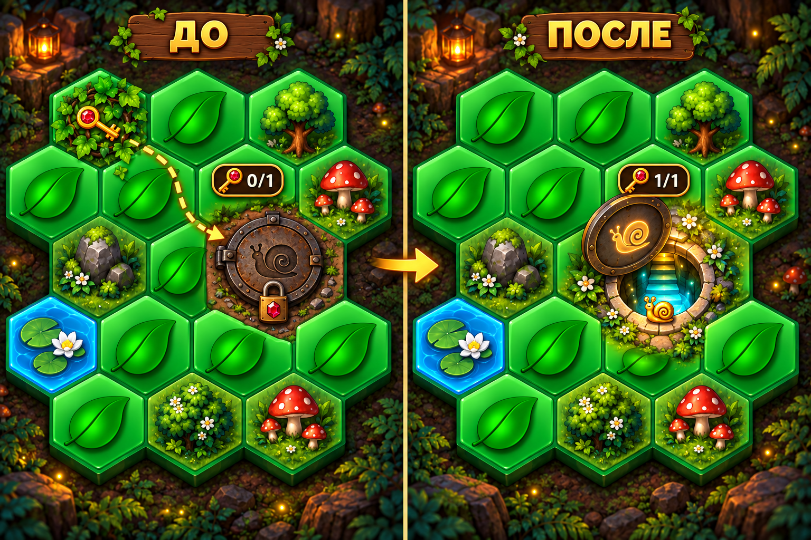

На картинке: ключ в лиане, рубиновый замочек, счётчик 0/1 и плоский оттиск улитки на металлической крышке. После открытия — чистый обод, свет на ступенях и действующий вход.

**Условие.** Сам люк становится виден после обычного вскрытия своей клетки. Оттиск сообщает тему содержимого: здесь — улиточный сайд-ивент. Рубин на замке и иконка ключа сообщают цену; счётчик показывает наличие ключа, после активации — выполнение условия.

**Действие и результат.** Освободить рубиновый ключ из лианы либо использовать запас → нажать люк → списать один ключ и сразу открыть вход. Дополнительного удара по крышке нет. Восстановленный спуск остаётся светиться после выдачи доступа. Тот же ключ можно сохранить или потратить на рубиновый сундук.

## 8 Шестерёнки запускают насос

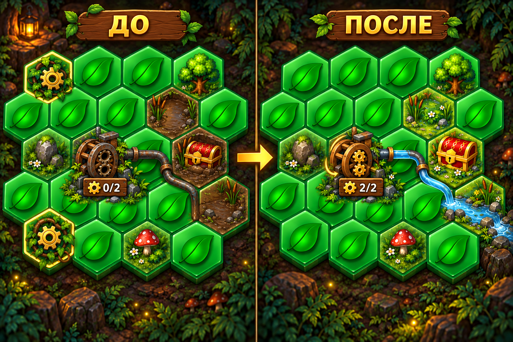

На картинке: два пустых гнезда насоса и две детали в лианах. После ремонта две заболоченные клетки осушены, третья становится чистым руслом; сундук поднят над грязью.

**Условие.** Найти две шестерёнки, снимая последние слои их лиан, и установить в насос. Находка не вскрывает обычный лист под лианой. Труба заранее показывает три клетки, которые изменятся.

**Результат.** Насос один раз снимает болотное покрытие с связанных клеток. Если под ним был лист, его ещё предстоит открыть; сундук становится доступным. Замок сундука — отдельное, заранее видимое условие. После сбора награды насос вращается, вода течёт, на берегу остаются цветы. Альтернативное размещение: насос освобождает деталь другого устройства вместо сундука.

## 9 Источник пробуждает засохший клён

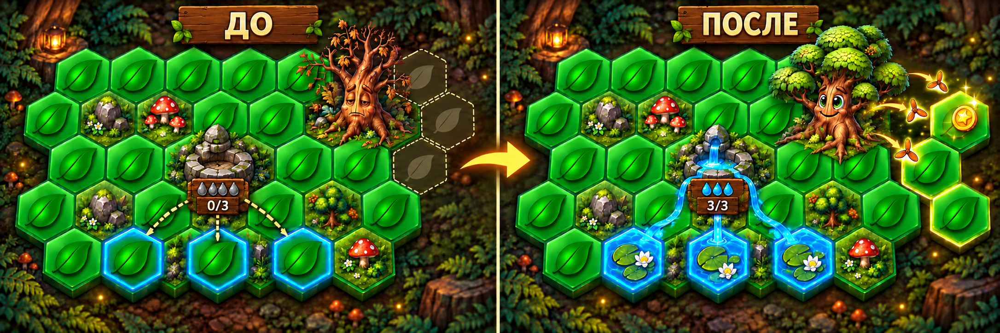

На картинке: сухой источник, спящий клён и три контура за краем. Три водных открытия возвращают течение; зелёный клён посылает семена в будущую бонусную поляну.

**Условие.** Открыть три отмеченные водные клетки, напрямую или помощью. Источник считает каждую один раз; при 3/3 вода достигает корней. Клён оживает и выпускает одну порцию из трёх семян.

**Результат.** Появляются три бонусные клетки, одна с обозначенной ценной находкой. Открывать их необязательно. Крона и источник остаются живыми после сбора бонуса.

**Связь с существующим клёном.** В проекте уже есть выброс семян и повторное засевание подходящих открытых клеток. Это можно использовать в первом прототипе. Показанная поляна за краем — предлагаемое расширение: заранее зарезервированные координаты с отдельными подсказками. Она не возникает в произвольном месте.

## 10 Два краба открывают стеклянный тайник

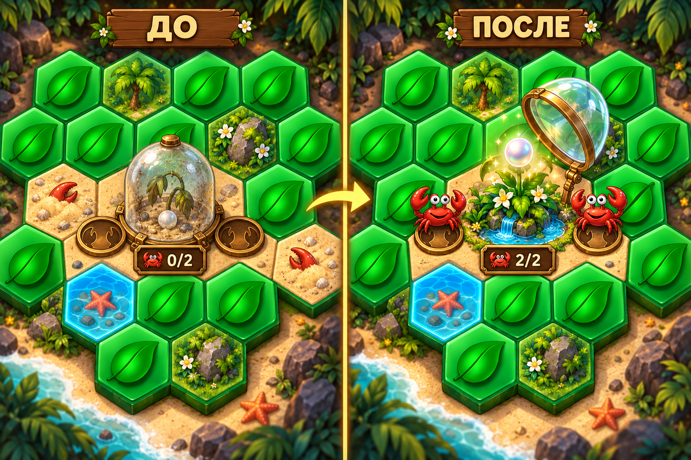

На картинке: жемчужина под грязным стеклом, две пустые площадки с клешнями и два намёка на крабов в песке. После — чистое поднятое стекло, пара крабов и цветущий оазис.

**Условие.** На двух песчаных покрытиях видны клешни. Снятие песка освобождает краба; лист под покрытием сохраняется. Краб сам занимает одну из площадок конкретного колпака. Требуется пара, порядок находок произвольный.

**Результат.** При 2/2 крабы поворачивают створки водовода: вода промывает стекло, колпак поднимается, растение расправляется и выдаёт одну жемчужину. Крабы остаются у оазиса. В другом шаблоне под колпаком может быть вход или дополнительная клетка; тип содержимого всегда виден через стекло.

## 11 Политый цветок выдаёт ценность

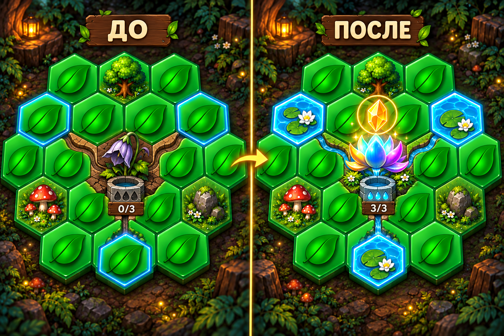

На картинке: увядший цветок и сухие канавки → наполненный резервуар 3/3 → раскрытые лепестки и один кристалл над ними.

**Условие.** Три отмеченные водные клетки питают резервуар. Когда открыты все три, полив срабатывает автоматически. Иконка в центре бутона заранее показывает класс награды.

**Результат.** Цветок выдаёт одну ценность и остаётся цветущим. Нажатия на уже открытую воду и повторный полив дополнительных наград не дают. Это наградной вариант цветка; нектарные бутоны из раздела 3 по-прежнему работают через бабочку.

**Выбор.** Взять основную цель ближайшим открытием или дойти до последнего источника. Если та же вода питает колесо либо клён, одно открытие завершит несколько подготовленных объектов.

## 12 Воздушный змей возвращает винт дирижабля

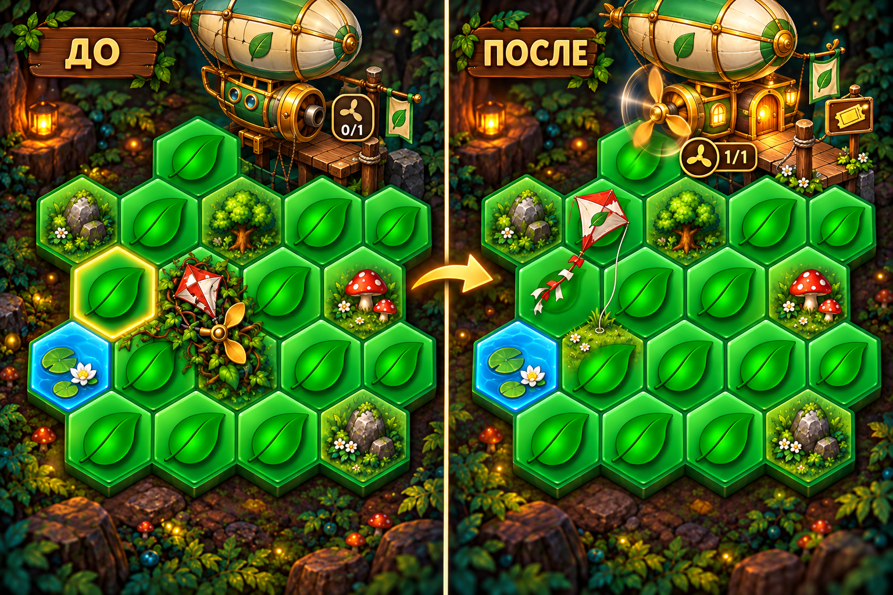

На картинке: винт запутан вместе со змеем, у двигателя пустое гнездо 0/1. После — змей летит на привязи, винт работает, вход в каюту освещён.

**Условие.** Снять лианы с клетки змея. Один винт выпадает как ремонтная деталь; змей расправляется автоматически. Установить винт в стоящий у края дирижабль.

**Результат.** Отремонтированный дирижабль открывает отдельный наградной уровень или сайд-ивент, обозначенный билетом у каюты. Он остаётся пришвартованным на текущем поле. Основная сюжетная цепочка продолжается обычной кнопкой. Змей сохраняется как видимый след выполненной активности.

## 13 Воздушный шар поднимает телескоп

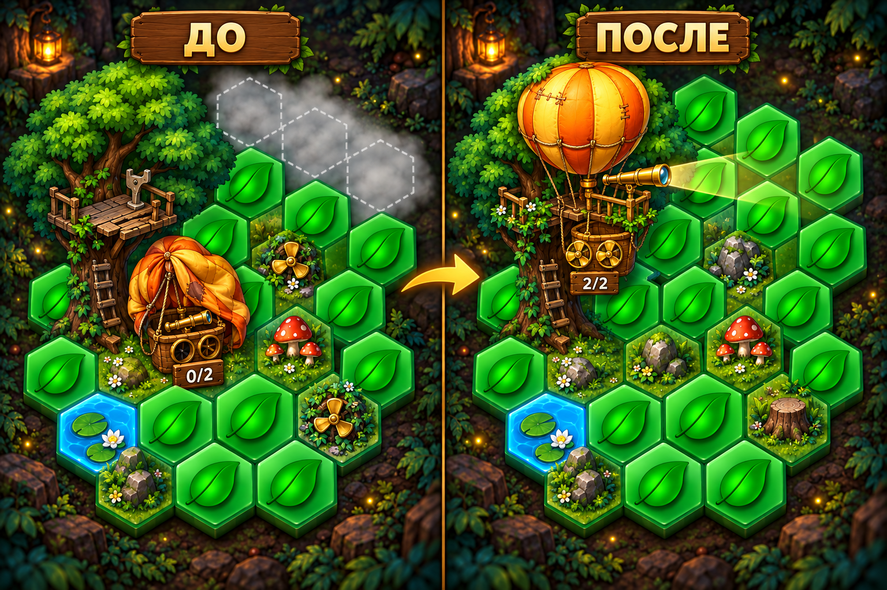

На картинке: сдутый шар с телескопом в корзине → работающая воздуходувка 2/2 → телескоп на дереве и три клетки за рассеявшейся дымкой.

**Условие.** Освободить два винта из зарослей на отмеченных клетках и установить в воздуходувку корзины. Шар поднимает телескоп к креплению на обзорной площадке; перила и настил восстанавливаются в той же анимации.

**Результат.** Телескоп делает доступными три заранее очерченные бонусные клетки у края. Их листья ещё нужно открыть. Направление обзора задано видимым креплением; игрок заранее знает, какую часть поля получит. Шар остаётся привязанным к целой площадке. Альтернативная награда — обнаруженный вход в событие в том же секторе.

## 14 Компас в руинах включает рычаг

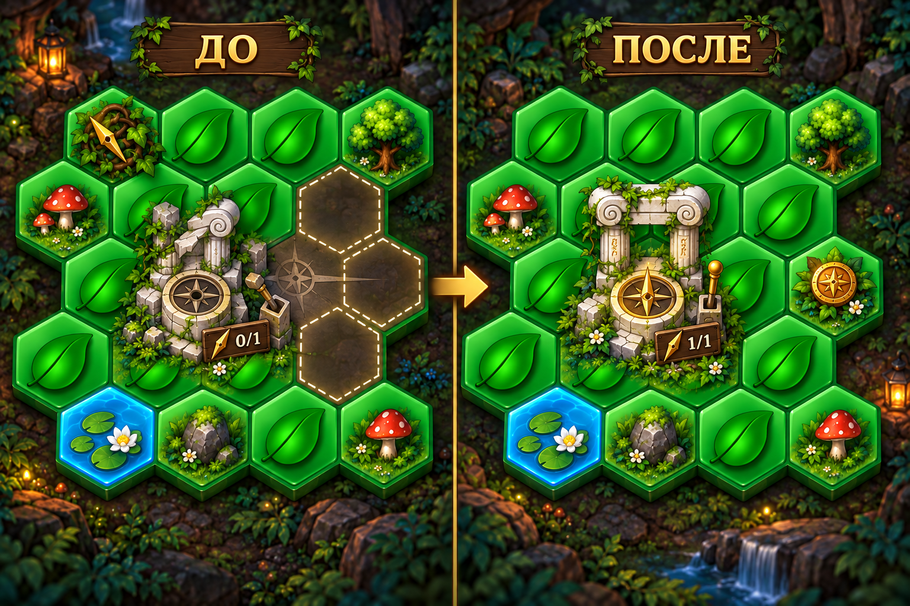

На картинке: пустой компас, доступный взгляду рычаг, стрелка в лиане и контуры отсутствующих клеток. После — целая арка и заполненная часть поля.

**Условие.** Рычаг и три контура видны уже в превью. Найти стрелку компаса и установить в пустое гнездо. После этого рычаг становится активным; его нажатие завершает восстановление.

**Результат.** Три тайные клетки материализуются в заранее заданных позициях. Медальон на одной сообщает о награде. Для варианта в центре поля заранее оставляется подходящий проём; у края — дополнительный выступ. Положение стрелки также указывает сектор появления, поэтому связь читается без диалога.

## 15 Шалаш освобождает проход под мега улиткой

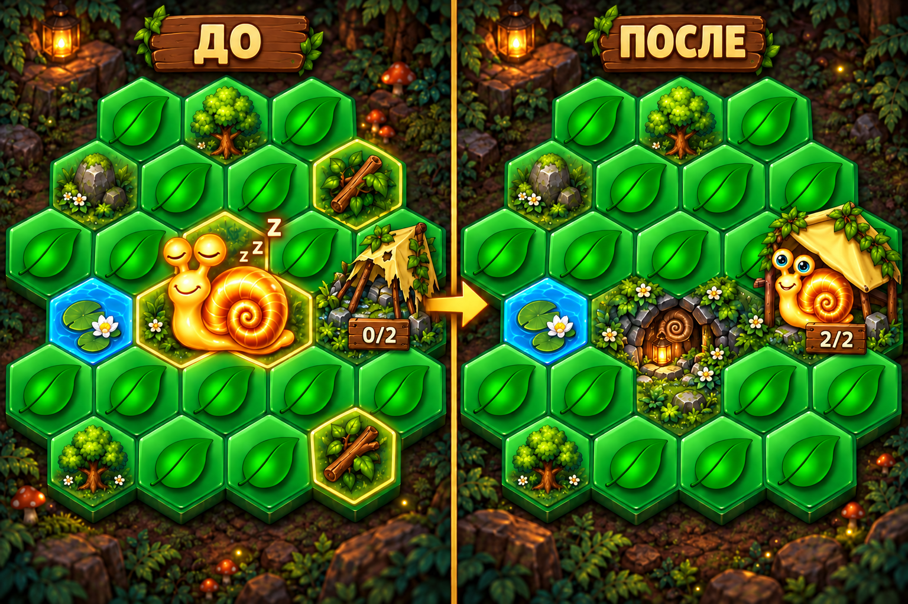

На картинке: спящая улитка занимает участок поля, рядом порванный шалаш. После установки двух опор она переходит под целую крышу; на прежнем месте виден вход.

**Условие.** Добыть две опоры из лиан и починить шалаш. В экономном варианте используются две единицы общей строительной древесины: можно потратить запас вместо поиска местных вложений. Цена и зона, которую освободит улитка, известны заранее.

**Результат.** Улитка просыпается и уходит в подготовленное убежище. Её участок становится доступным: обычные листья сохраняются, пещера открывает улиточный бонусный уровень. Шалаш и бодрая улитка остаются на поле. Это альтернативный способ подготовить вход; обязательного ключа сверх показанного ремонта нет.

## 16 Линза возвращает свет маяку

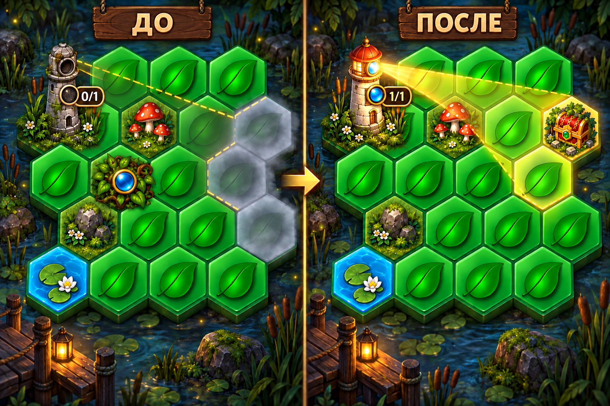

На картинке: тёмная башня с пустым гнездом, линза в лиане и видимый сектор света. После ремонта в секторе читаются листья и сундук.

**Условие.** Освободить линзу и установить её в маяк. Три клетки сектора и направление луча показаны до ремонта.

**Результат.** Маяк снимает туман с этих клеток: можно увидеть покрытия, предметы и выбрать следующие открытия. Листья и лианы сохраняются. Подсвеченный сундук ещё нужно освободить и открыть подходящим ключом. Свет остаётся включённым до конца уровня.

**Вариант взаимодействия.** Колесо из раздела 2 может освободить линзу своим эффектом. Тогда открытия воды одновременно продвигают основную цель и готовят разведку секретного сектора.

## 17 Топор восстанавливает переход через болото

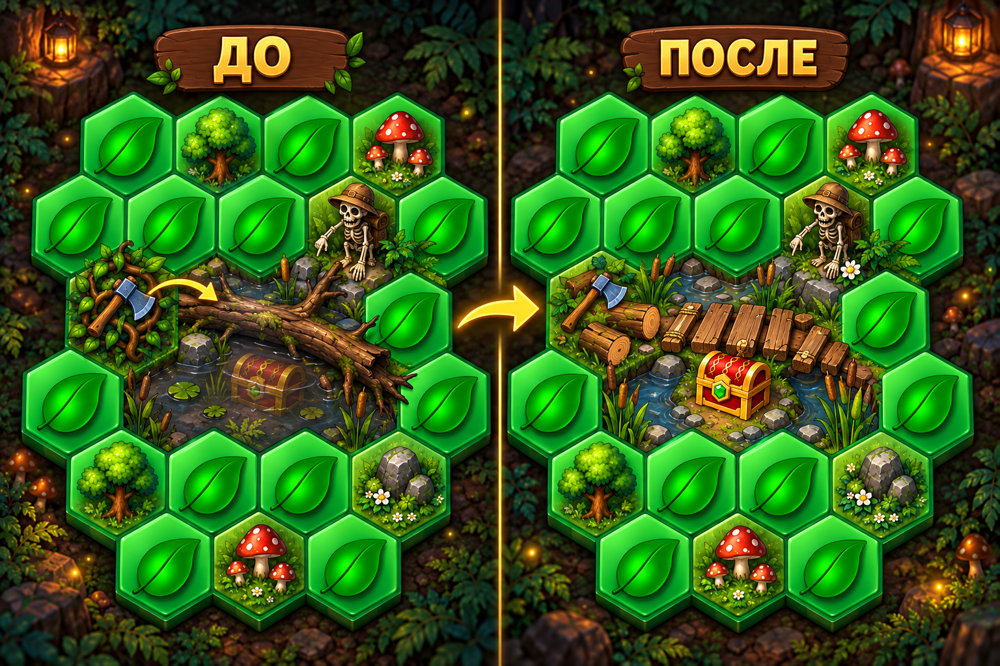

На картинке: упавшее сухое бревно перекрывает сток; скелет старого исследователя указывает на сундук под водой. После — восстановленный настил и сундук на сухом месте.

**Условие.** Освободить топор из лиан, затем применить к отмеченному завалу. Одного применения достаточно: бревно разбирается, вода уходит по руслу, части бревна складываются в настил.

**Результат.** Сундук становится доступным, его видимый замок по-прежнему требует ключ. Настил и чистый сток остаются после награды. Скелет служит постоянной визуальной подсказкой направления поиска. В другом размещении завал можно устранить связанным механизмом; второй способ не выдаёт награду повторно.

## 18 Гига желе переселяется в восстановленный сад

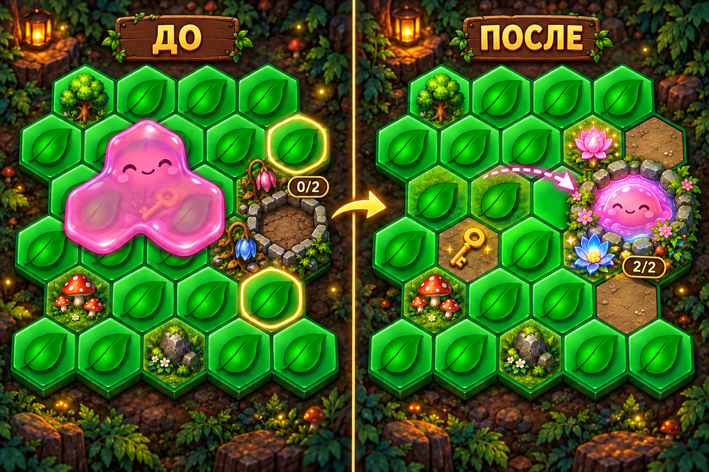

На картинке: сквозь желе видны листья и ключ. После двух соседних открытий бутоны цветут, желе занимает чашу у края, а его прежние клетки доступны.

**Условие.** Пробудить оба отмеченных нектарных бутона обычными соседними открытиями. Каждый даёт один из двух сигналов приманки. Чаша и конечное положение желе заданы заранее.

**Результат.** Желе целиком освобождает свой участок и остаётся живым розовым прудиком среди цветов. С открытой клетки можно забрать ключ; два листа на остальных клетках ещё закрыты. Если цветок помощи или бустер открывает соседа бутона, это также считается. Повторно уводить желе ради второй награды нельзя.

## 19 Починенная лесенка открывает верхний слой

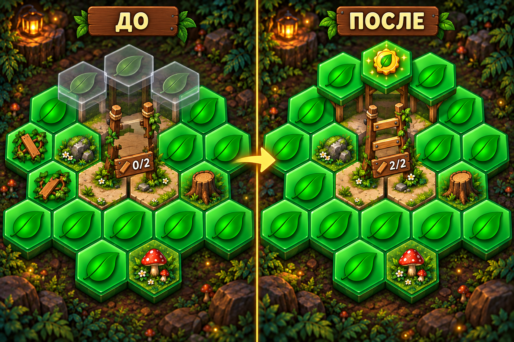

На картинке: три полупрозрачные верхние клетки, открытые нижние опоры и лесенка без ступеней. После ремонта верхние клетки становятся полноценным слоем с бонусом.

**Условие.** Выполнить два требования в любом порядке: открыть три отмеченные нижние клетки и установить две найденные ступени. На иллюстрации нижние опоры уже открыты; осталось закончить ремонт 0/2 → 2/2. Пока опоры закрыты, у их контуров видны отдельные метки готовности.

**Результат.** Лесенка соединяется с площадкой; на тех же координатах, выше нижнего слоя, становятся доступны три новых листа. Подложка и тени показывают наложение по принципу маджонга. Подсказки верхнего слоя работают внутри него. Площадка не закрывает незавершённые обязательные клетки: активация возможна только над уже открытыми опорами. После сбора бонуса остаётся целая лесенка с зелёными перилами.

## 20 Лебёдка поднимает решётку пещеры

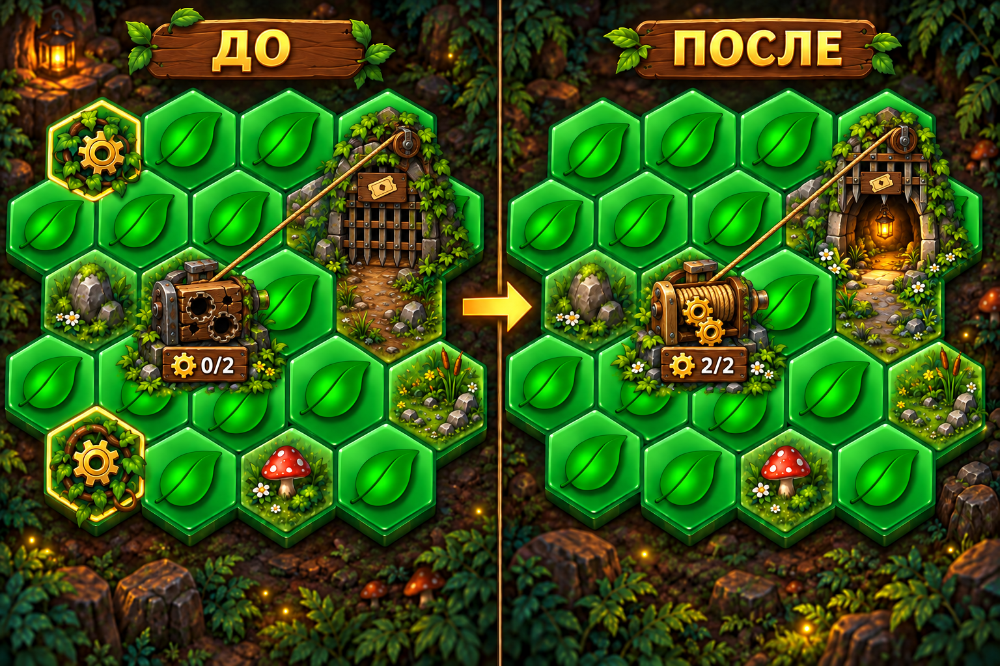

На картинке: две шестерёнки видны в лианах, трос соединяет сломанный барабан с решёткой. После ремонта барабан цел, решётка поднята, проход освещён.

**Ремонт — 2 шестерёнки.** Лебёдка сразу поднимает связанную решётку. На входе заранее виден значок содержимого: бонусный уровень, сайд-ивент или сундук. Для показанной пещеры сам ремонт полностью открывает доступ. Дальнейшие удары по механизму не нужны; трос остаётся натянутым, вход — открытым.

**Общее правило для этих шести устройств и насоса из раздела 8.** Шестерёнка — одинаковый переносимый предмет текущего уровня. Она видна в лиане и выпадает при снятии её последнего слоя; обычный лист сохраняется. Детали поступают в общий запас. Игрок нажимает выбранное устройство и оплачивает весь ремонт, если деталей достаточно. Шестерёнки не привязаны к месту находки или конкретному механизму. Цены ниже — настройки прототипа.

| Устройство | Шестерёнки | Эффект на поле |
| --- | --- | --- |
| Лебёдка | 2 | Поднимает решётку одного входа |
| Дождеватель | 2 | Поливает одну выбранную пару растений |
| Ветродуй | 1 | Снимает слой песка с трёх клеток |
| Поворотное зеркало | 1 | Направляет свет в сектор или на печать |
| Подъёмник | 3 | Делает доступной бонусную площадку из трёх клеток |
| Шпалера с воротом | 2 | Снимает слой связанных лиан с трёх клеток |

При трёх доступных шестерёнках возникает выбор: один подъёмник или сочетание устройств за 2 + 1. Находки остаются конечными, каждый механизм даёт полезный эффект один раз. Все выходы, цены и возможные награды видны до ремонта; после него устройство сохраняет работающий вид.

## 21 Дождеватель поливает выбранную клумбу

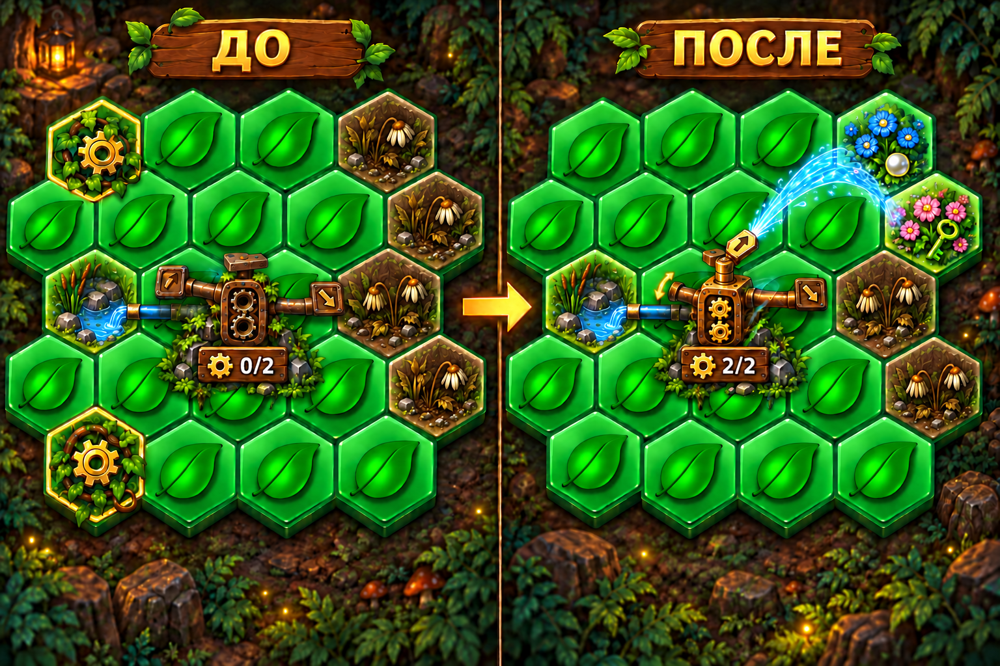

На картинке: вода уже подведена, но поворотный привод сломан. После ремонта верхняя пара цветов получает воду и выдаёт жемчужину с ключом; нижняя пара остаётся сухой.

**Ремонт — 2 шестерёнки.** Затем игрок выбирает одну из двух отмеченных пар клеток и запускает единственный полив. Выбор направления до запуска свободный. Каждому выбранному растению засчитывается полный полив: наградной цветок выдаёт предмет, засохший клён просыпается. Для варианта с клёном он занимает одно из мест выбранного сектора.

**Выбор.** Одна клумба может давать ключ и текущую награду, другая — пробуждать клён с дополнительными клетками. Состав и иконки наград задаются заранее. Полив не вскрывает обычные листья. После срабатывания выбранные растения цветут, дождеватель остаётся целым, повторного полезного полива нет.

## 22 Ветродуй освобождает клетки от песка

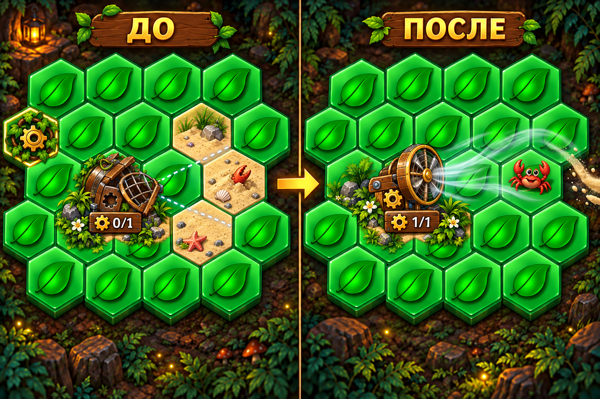

На картинке: шестерёнка в лиане, сломанный вентилятор и три песчаные клетки в секторе. После — песок унесён, листья целы, краб освобождён.

**Ремонт — 1 шестерёнка.** Ветродуй один раз снимает один слой песка с трёх заранее отмеченных клеток. Лианы и доски останавливают этот эффект. Листья под песком остаются закрытыми, но предметы в снятом покрытии выдаются сразу.

**Связка.** Освобождённый краб занимает площадку стеклянного тайника из раздела 10. Если второй краб уже найден, тот открывается в этой же цепочке. Игрок сравнивает стоимость добычи шестерёнки со стоимостью прямой расчистки песка. После порыва на поле остаются целый вентилятор и чистый участок.

## 23 Поворотное зеркало меняет направление света

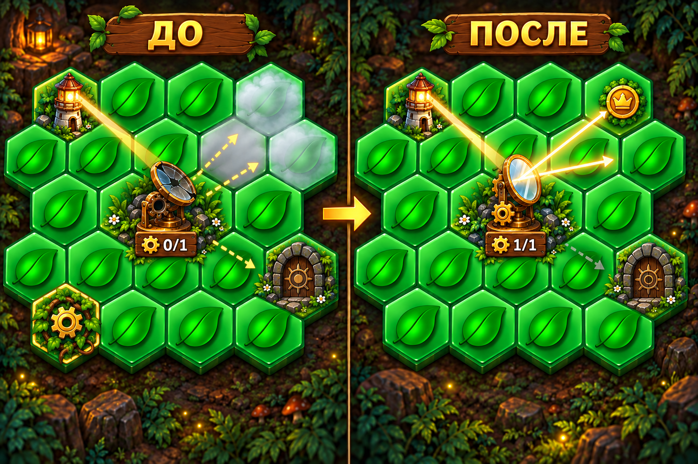

На картинке: свет работающего маяка упирается в сломанное зеркало. После ремонта отражённый свет снимает туман с верхнего сектора; печать нижней двери остаётся тёмной.

**Ремонт — 1 шестерёнка.** У зеркала два фиксированных направления: три клетки под туманом или световая печать двери. После ремонта игрок выбирает направление и фиксирует его рычажком. Полезное срабатывание одно; выбранная ориентация сохраняется до конца уровня.

**Условие работы.** Нужен луч от связанного маяка. Зеркало можно починить и настроить заранее: оно сработает, когда зажжётся маяк. В первом направлении снимается только туман; во втором активируется одна печать входа. Если у входа есть другой замок, он виден заранее. Так линза, шестерёнка и ключ участвуют в одной необязательной цепочке.

## 24 Подъёмник возвращает площадку на поле

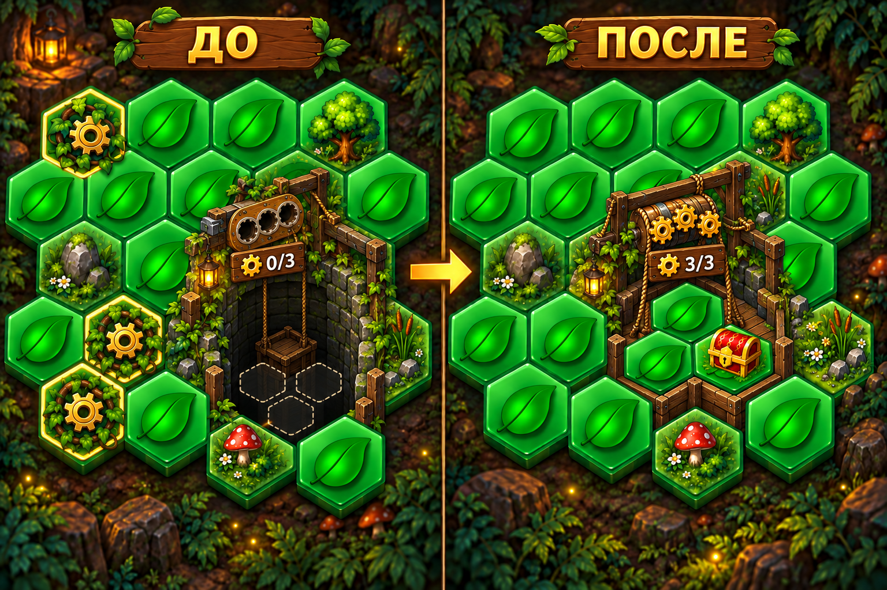

На картинке: три пустых гнезда, шестерёнки в трёх лианах и платформа в глубине. После ремонта наверху появляются две закрытые клетки и сундук.

**Ремонт — 3 шестерёнки.** Подъёмник поднимает одну платформу в заранее зарезервированный проём поля. Её размер и значок награды видны в превью. В показанном варианте доступны два новых листа и сундук; вариант с замком заранее показывает его на значке платформы.

**Результат.** Это отдельная бонусная область со своими подсказками, как у секретной поляны клёна. Исходные клетки и числа сохраняются. Платформа поднимается один раз, затем становится целой площадкой с натянутыми тросами и перилами. Её высокая цена создаёт альтернативу двум небольшим ремонтам.

## 25 Шпалера с воротом стягивает лианы с клеток

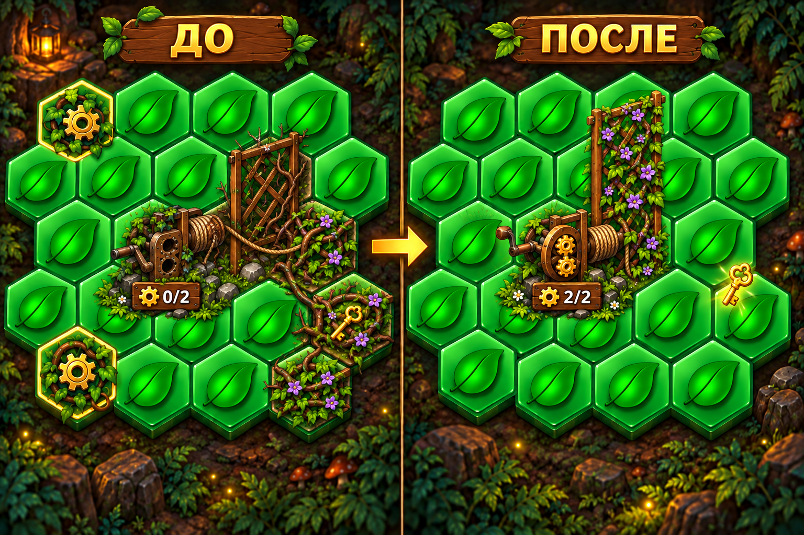

На картинке: три клетки опутаны одной цветущей лианой, в ней застрял ключ. После ремонта растения подняты на решётчатую опору; ключ свободен, обычные листья сохранены.

**Ремонт — 2 шестерёнки.** Ворот натягивает трос и снимает один слой специальной связанной лианы с каждой из трёх клеток. Связь с опорой видна по стеблю. У многослойной лианы остаются нижние слои; предмет выпадает только после последнего.

**Связка.** В одном из снимаемых покрытий может находиться следующая шестерёнка. Тогда ремонт за две детали освобождает ещё одну для ветродуя или зеркала. Это заранее размещённая находка с однократной выдачей. После срабатывания на поле остаётся восстановленная шпалера с живыми цветущими лианами.
