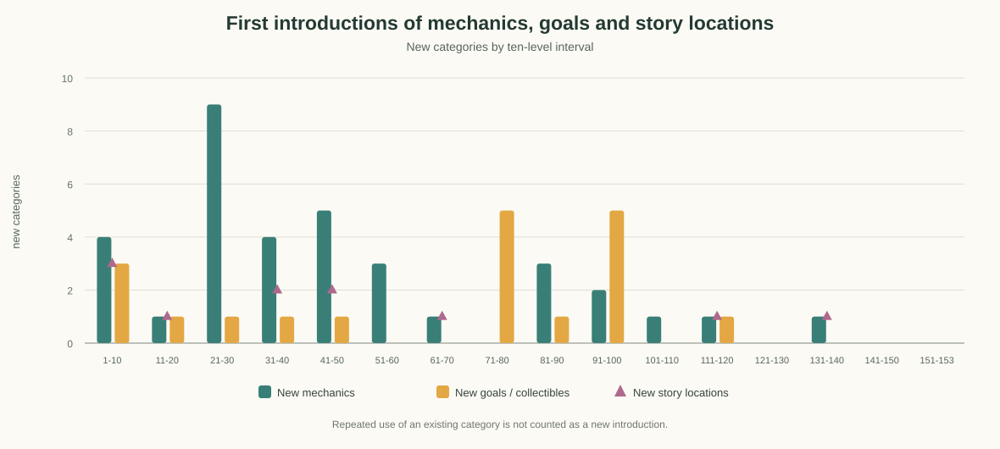

# Темп новых механик и оригинального контента

## Краткий вывод

В `ForestConfiguration` задано 153 последовательных уровня, 1–153. Введение правил сгущается на уровнях 21–50, затем редеет: в диапазоне 71–80 не появляется нового типа механики, а в 141–153 не появляется ни нового типа механики, ни новой цели или находки. Новые предметы ненадолго возвращаются на 91–100; это поддерживает разнообразие целей, но не заменяет новых способов взаимодействия.

Сюжетные сцены сгущены в начале: после чердака на уровне 64 следующая впервые встречающаяся отдельная локация — лагерь на 111-м (47 уровней), затем цветочные поля на 134-м (23 уровня). Это самое заметное окно для добавления новой локации или крупного сюжетного набора.

## График

## Данные по диапазонам

| Уровни | Новые типы механик | Новые типы целей / находок | Новые сюжетные локации |
|---|---:|---:|---:|
| 1–10 | 4 | 3 | 3 |
| 11–20 | 1 | 1 | 1 |
| 21–30 | 9 | 1 | 0 |
| 31–40 | 4 | 1 | 2 |
| 41–50 | 5 | 1 | 2 |
| 51–60 | 3 | 0 | 0 |
| 61–70 | 1 | 0 | 1 |
| 71–80 | 0 | 5 | 0 |
| 81–90 | 3 | 1 | 0 |
| 91–100 | 2 | 5 | 0 |
| 101–110 | 1 | 0 | 0 |
| 111–120 | 1 | 1 | 1 |
| 121–130 | 0 | 0 | 0 |
| 131–140 | 1 | 0 | 1 |
| 141–150 | 0 | 0 | 0 |
| 151–153 | 0 | 0 | 0 |

## Сюжетные и предметные вехи

Отдельные сюжетные локации впервые появляются на уровнях: 2 — дом и сундук; 3 — открытый сундук; 14 — котёл; 32 — тёмный лес; 37 — встреча с единорогом; 44 — лес; 47 — костёр; 64 — чердак; 111 — лагерь; 134 — цветочные поля.

Первые появления целей и находок также становятся реже и затем идут отдельными всплесками: стартовые грибы — уровни 1–7; водяная лилия и лаванда — 15 и 22; аманита — 33; полено — 47; новые ягодные и грибные цели — 74–100; янтарь — 116. После 116-го уровня в конфигурации не появляется нового имени цели.
## Интерпретация и следующие шаги

- Уровни 21–30 дают максимальный скачок: 9 новых типов механик. Следующие два диапазона 31–50 удерживают темп, поэтому здесь удобно учить игрока короткими сериями с возрастающей нагрузкой.
- Уровни 51–70 спокойнее. Уровни 71–80 полностью без новой механики, хотя вводят пять новых типов целей; это похоже на контентный, а не системный апдейт.
- Уровни 81–100 содержат пять новых типов механик и шесть новых целей суммарно — заметный всплеск после паузы. Стоит проверить, есть ли для каждой новой цели вводный и закрепляющий уровень.
- На 101–153 правила почти не пополняются: всего три типа механик, одна новая цель и две новые локации по первым появлениям. Для длинного хвоста это риск однообразия, даже если меняются карты и числа.
- Планировать следующую длинную дугу лучше парами: сначала показать новую механику в безопасной раскладке, затем соединить её со знакомыми механиками; крупную смену локации ставить перед такой дугой и подкреплять новым визуальным объектом или сюжетным действием.

## Метод и ограничения

Источник — порядок записей `ForestConfiguration.allForests` и первые `location` в `ReplicasConfiguration.allReplicas`. «Новая механика» здесь означает первое появление специального символа маски или флага/счётчика уровня; «новая цель» — первое имя из `items` или `interactiveItems`; локация учитывается при первом сюжетном контексте реплики. Повторное сочетание механик, повышение сложности, новая раскладка поля и повторные сюжетные сцены не считаются новизной. График измеряет частоту введения категорий по исходникам, а не художественную оригинальность или субъективную сложность.

Данные можно пересчитать командой `node tools/analyze-level-progression.js`.

